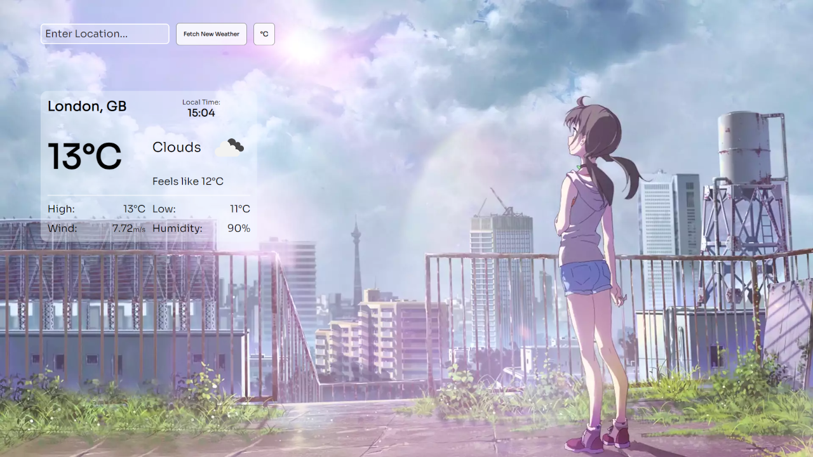
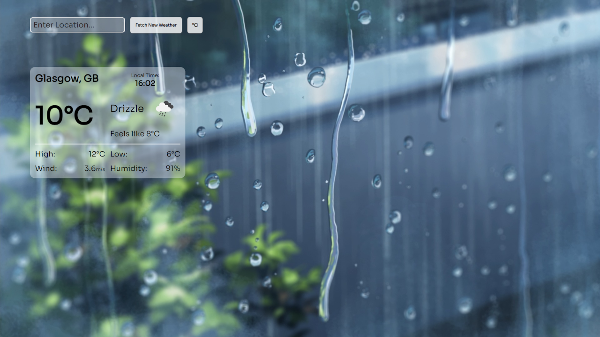

# Weather App

## 📌 Overview

A web app that shows the weather on diffrent places on Earth. This project was made as a learning experience for REST APIs.

## 🛠️ Tech stack

- Frontend: Vanilla Javascript

## 🚀 Features
- Search function for displaying weather in different cities
- Pretty images that change based on the current weather on the selected location

## 📸 Screenshots

	
	

## 🔗 Live Site

[App Demo](https://nenopr.github.io/weather-app-TheOdinProject/)
